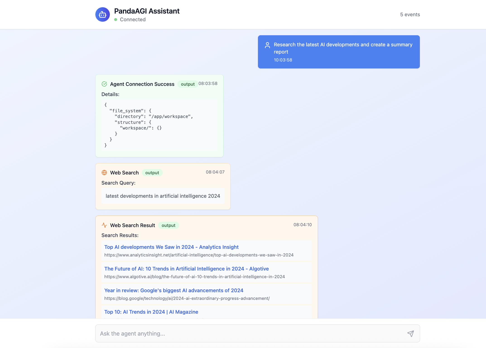

# PandaAGI SDK - An SDK for AGI (Agentic General Intelligence)

[](https://pypi.org/project/panda-agi/)
[](https://discord.gg/KYKj9F2FRH)
[](https://pepy.tech/project/panda-agi)
[](https://opensource.org/licenses/MIT)


The PandaAGI SDK provides a simple, intuitive API for building general AI agents in just a few lines of code. It abstracts away the complexity of Agentic Loops and provides a powerful interface for you to build autonomous agents.
Each agent can be configured to run in a custom environment, interacting with the web, your file system, writing code, and running shell commands.

## Installation

```bash
pip install panda-agi
```

Or with uv:

```bash
uv add panda-agi
```

## 🔧 Getting started

```python
import asyncio
from panda_agi import Agent
from panda_agi.envs import LocalEnv

async def main():
    # Create a custom environment for the agent
    agent_env = LocalEnv("./my_agent_workspace")
    
    # Create the agent
    agent = Agent(environment=agent_env)
    
    # Run the agent with a prompt
    response = agent.run("Tell me a joke about pandas")
    print(response.output)
    
    # Disconnect when done
    await agent.disconnect()

if __name__ == "__main__":
    asyncio.run(main())
```

## 📱 Running with the UI

In case you don't want to build an app from scratch, we provide a UI that you can use to run your agents.

Running it is as simple as:

```bash
# Run the UI
cd examples/ui
./start.sh
```

This will start a docker container with the UI running. You can access it at `http://localhost:3000` and start using it.

[](docs/images/chat_interface.png)

## 🛠️ Features

- Simple, intuitive API for interacting with PandaAGI agents
- Support for local and Docker environments
- Asynchronous event-based communication
- Pydantic models for type safety

## 📚 Documentation

For complete documentation, visit our [documentation site](https://agi-docs.pandas-ai.com).

## 🛠️ Development

### Prerequisites

- Python 3.8+
- uv

### Setup

1. Clone the repository
2. Install dependencies:

```bash
uv pip install -e ".[dev]"
```

### Testing

Run tests with pytest:

```bash
uv run pytest
```

## 📝 License

MIT License
